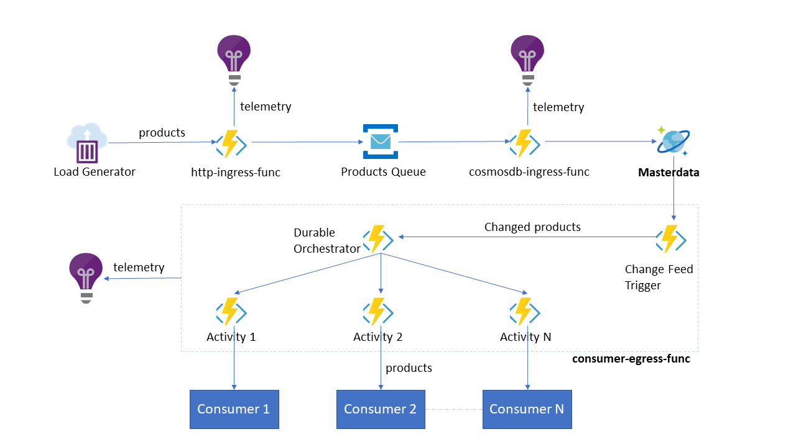

# azure-event-driven-data-pipeline

## Problem
A large retailer with many source systems, wants a single source of truth of their data and be able to send updates to their consumers whenever this data is changed. They want to support an unpredictable load, with a max spike of 1500 req/sec.

>Contents of this repo were demonstrated during [Stockholm Azure meetup March 2018](https://www.meetup.com/Stockholm-Azure-Meetup/events/247951748/).

## Architecture
<div style=""></center></div>

## Deployment
[](https://azuredeploy.net/)

The entire deployment can be orchestrated using [ARM template](https://docs.microsoft.com/en-us/azure/azure-resource-manager/resource-manager-create-first-template) `azuredeploy.json`.
Once the deployment is complete, the only manual step is to copy `ConsumerReceiveFunc` URL from the Azure portal and paste it multiple times (pipe `|` delimited) in `ConsumerEgressFunc` -> App Settings -> `CONSUMERS`.

## Running load tests
We perform the load tests using [Azure Container Instances](https://docs.microsoft.com/en-us/azure/container-instances/container-instances-overview). After creating resources using the above ARM template, run the following load testing script;
```
./generate-load.sh azure-meetup loadgen-container https://http-ingress-func.azurewebsites.net/api/HttpIngressFunc?code=<FUNCTION_KEY>
```

Here is how to stream logs from the container;
```
az container attach -g azure-meetup -n loadgen-container
```

## Measuring Cosmos DB RUs using Application Insights
When we upsert into Cosmos DB, we log the [Request Units](https://docs.microsoft.com/en-us/azure/cosmos-db/request-units) consumed in [Application Insights](https://docs.microsoft.com/en-us/azure/application-insights/app-insights-overview). The following Application Insights analytics query renders a timechart of RUs consumed, aggregated on 10 seconds.
```sql
customMetrics
| where timestamp > datetime("2018-03-05T12:26:00")
    and name == "product_RU"
| summarize avg(value) by name, bin(timestamp, 10s)
| render timechart
```

## Resources
[Choose between Azure services that deliver messages](https://docs.microsoft.com/en-us/azure/event-grid/compare-messaging-services)

[Choose between Flow, Logic Apps, Functions, and WebJobs](https://docs.microsoft.com/en-us/azure/azure-functions/functions-compare-logic-apps-ms-flow-webjobs)

[Durable Functions overview](https://docs.microsoft.com/en-us/azure/azure-functions/durable-functions-overview)

[Azure Functions quickstart starter sample](https://github.com/Azure-Samples/functions-quickstart)

[Understanding Serverless Cold Start](https://blogs.msdn.microsoft.com/appserviceteam/2018/02/07/understanding-serverless-cold-start/)

[Choose the right data store](https://docs.microsoft.com/en-us/azure/architecture/guide/technology-choices/data-store-overview)

[Modeling document data for NoSQL databases](https://docs.microsoft.com/en-us/azure/cosmos-db/modeling-data)

[Load testing with Azure Container Instances and wrk](https://blog.vjrantal.net/2017/08/10/load-testing-with-azure-container-instances-and-wrk/)